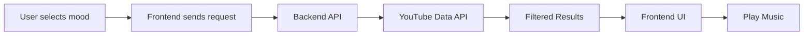

# 🎧 Vibescape

> 🚀 A modern **mood-based music discovery platform** powered by YouTube API — built like a real SaaS product.

---

## 🌟 Overview

**Vibescape** is a full-stack web app that lets users discover and play music based on their mood.

✨ Clean UI
⚡ Fast API integration
🎵 Real-time YouTube music playback


---

## 🎥 Demo Preview


---

## ⚙️ Features

* 🎭 Mood-based recommendations (Happy, Sad, Energetic)
* 🔍 Smart search system
* ▶️ YouTube music player integration
* ❤️ Favorites system (local storage)
* 🎨 Modern UI with animations
* ⚡ Fast backend with Express.js
* 🔐 API-based architecture

---


## 🧠 How It Works



---

## 🗂️ Project Structure

```
vibescape/
│
├── frontend/
│   ├── pages/
│   ├── components/
│   ├── css/
│   ├── js/
│   ├── assets/
│   └── data/
│
├── backend/
│   ├── server.js
│   ├── routes/
│   ├── controllers/
│   ├── services/
│   ├── utils/
│   ├── config/
│   ├── .env
│   └── package.json
```

---

## 🔌 API Endpoints

### 🎭 Get Songs by Mood

```
GET /api/music/mood/:mood
```

### 🔍 Search Songs

```
GET /api/music/search?q=QUERY
```

---

## 🎯 Mood Mapping

| Mood        | Query Used                |
| ----------- | ------------------------- |
| 😊 Happy    | happy upbeat songs        |
| 😔 Sad      | sad emotional songs       |
| ⚡ Energetic | workout high energy songs |

---

## 🛠️ Tech Stack

* ⚛️ Frontend: HTML, CSS, JavaScript
* ⚙️ Backend: Node.js, Express.js
* 📡 API: YouTube Data API v3
* 💾 Storage: LocalStorage
* 🔗 HTTP Client: Axios / Fetch
* 🔐 Env: dotenv
* 🌐 CORS enabled

---

## 🚀 Setup Instructions

### 1️⃣ Clone the repo

```bash
git clone https://github.com/Inexpert-trifler/Vibescape.git
cd Vibescape
```

---

### 2️⃣ Backend Setup

```bash
cd backend
npm install
```

Create `.env` file:

```env
YOUTUBE_API_KEY=your_api_key_here
PORT=5001
```

Run backend:

```bash
node server.js
```

---

### 3️⃣ Frontend Setup

```bash
cd frontend
npx live-server
```

---

## ⚠️ Important Notes

* Some YouTube videos may not support embedding
* App automatically handles fallback
* API key should not be exposed publicly

---

## 📈 Future Improvements

* 🎵 Playlist system
* 👤 User authentication
* 📊 Listening history
* 🤖 AI-based recommendations
* 🌍 Deployment (Vercel + Render)

---

## 🤝 Contributing

Contributions are welcome!

```bash
fork → clone → create branch → commit → PR
```

---

## 📄 License

MIT License © 2026 Vibescape

---

## 💡 Author

👨‍💻 **Saransh Yadav**
🚀 Building real-world projects & learning in public

---

## ⭐ Support

If you like this project:

👉 Star this repo
👉 Share with friends
👉 Give feedback

---

> 💬 *"Code. Build. Break. Repeat."*
